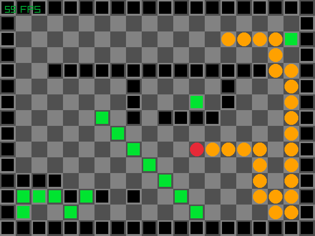

# BrainSnake

[](https://travis-ci.org/shybyte/brain-snake)

A snake puzzle game written in Rust.



## Status

First version with only one dummy level.

## Run it

  1. Install Rust (https://www.rust-lang.org/tools/install)
  2. ```cargo run``` 

## License and Copyright
Copyright (C) 2020 Marco Stahl

GNU Affero General Public License v3.0

